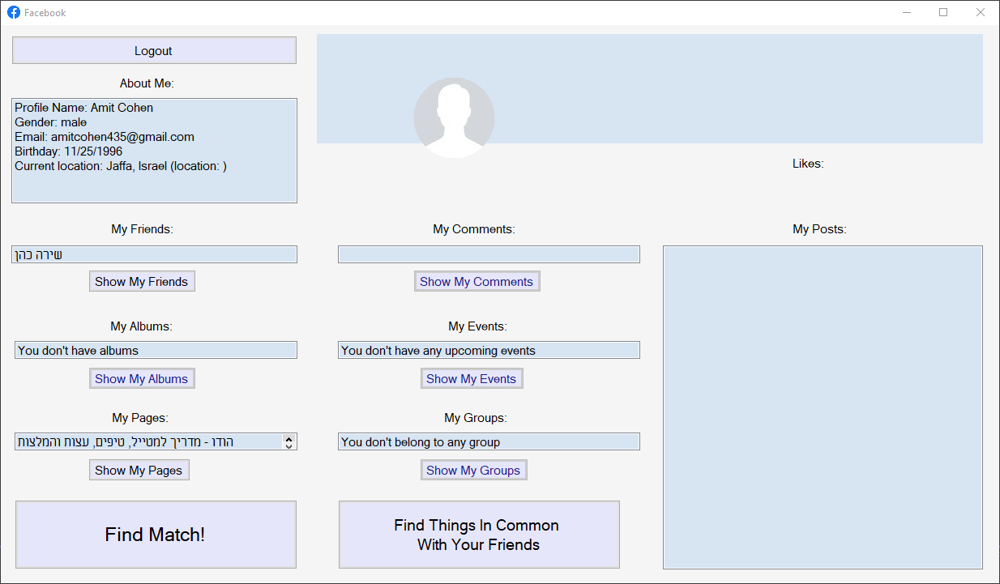
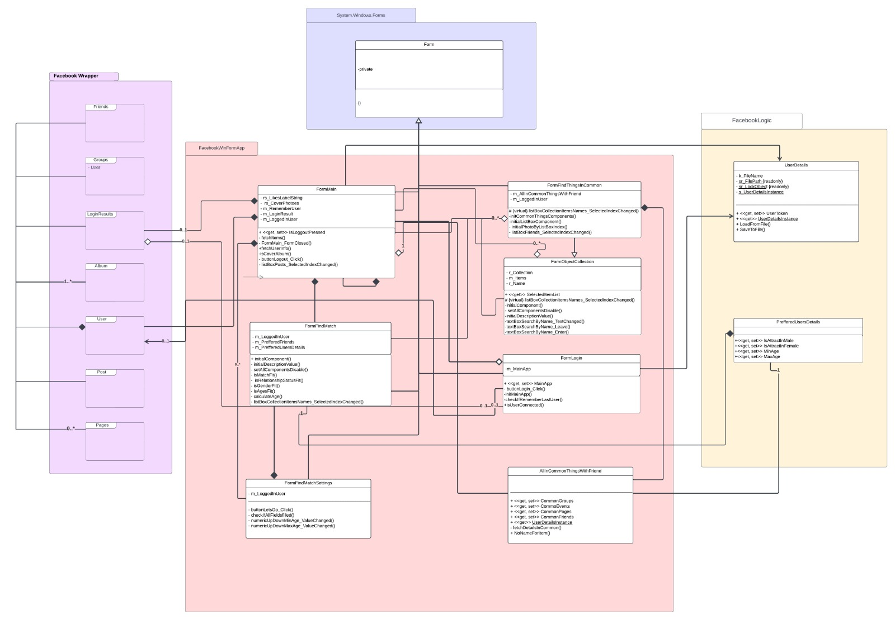
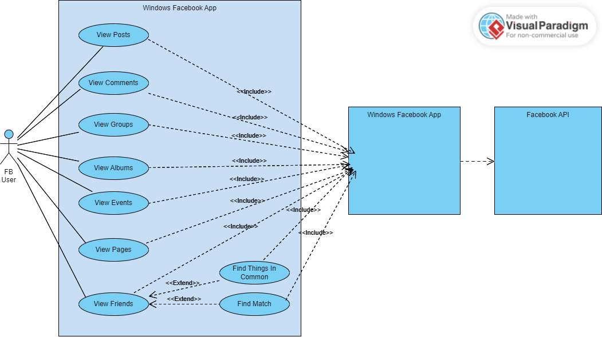
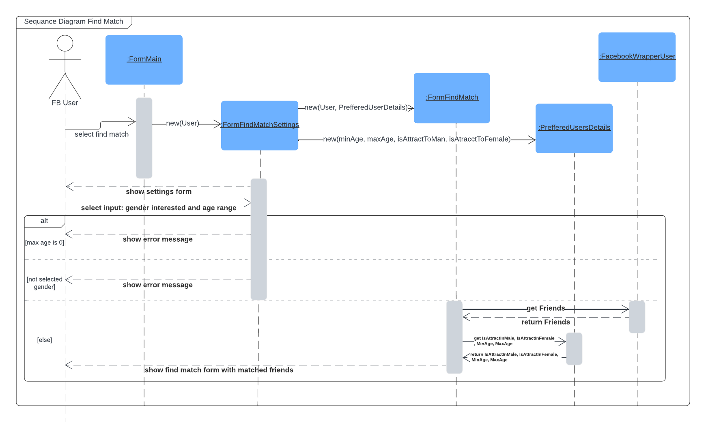
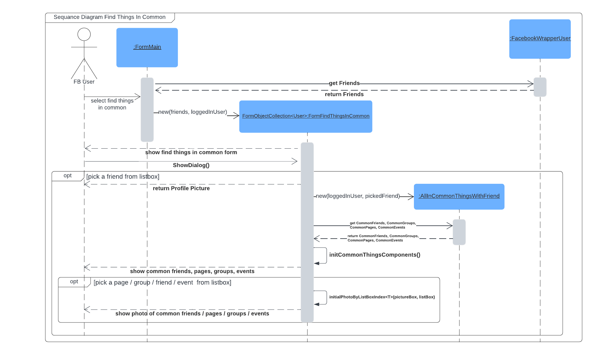

<h1 align="center">Facebook App</h1>

<strong>Windows Edition - by Amit Cohen</strong>
 Students project for Design Patterns course - The Academic College of Tel Aviv - Yaffo

<h2>About</h2>

This is a windows facebook app.

Delivers maximum facebook experience by using Facebook API.

Implement two new teatures:

1. Find Match - filter your friends by ages and gender and find potential soulmate.
   Filtering by ages, gender and relationship status.
2. Find All Things in Common - pick a friend and you will see all the common things between you and him - 
   - Common friends, groups, events, pages.

<h2>Implements By:</h2>

- Polymorphism 
- Windows Forms - Graphic App
- Collections
- XML Serilazition
- Generics
- Singelton Design Pattern
- Exceptions
- Using an outer assembly (DLL)
- Facebook API 

<h2>Project status</h2>

Completed

<h2>App Forms</h2>

 

<h2>Diagrams</h2>

<h3>Slass Diagram</h3>

<h3>Use Case Diagram</h3>

<h3>Sequance Diagrams</h3>

<h2>Credits</h2>

- Lecturer: <a href="https://www.facebook.com/guy.ronen" target="_blank">Guy Ronen</a>
- <a href="https://www.mta.ac.il/" target="_blank">The Academic College of Tel Aviv - Yaffo</a>
- Logo & Design: <a href="https://www.flaticon.com/free-icons/facebook" title="facebook icons">Facebook icons created by Pixel perfect - Flaticon</a>

<h2>License</h2>

This project is licensed under the MIT License - see the [LICENSE](LICENSE) file for details
